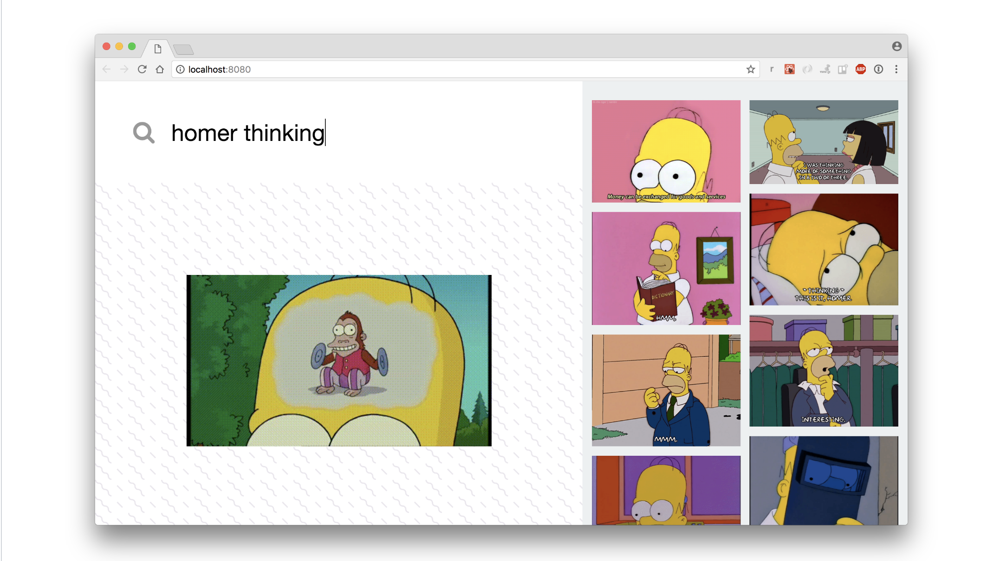

# TechLabs_Web_Dev_Exam
Final exam for our TechLabs Barcelona batch in February 2020

## Why exam?
In order ro assess your progress we have prepared a challenge for you. Now, the main reason fo having this is that we can't assess your progress solely based on the analytical tools we have since those are easy to cheat on. Moreover, this year some of our projects will be of professional nature. We are currently finalizyng some of the contracts and are looking for capable people to deliver. 

## Synopsis
Let me explain the parts of the exam. First of all you will have a final decision of choosing to complete either an easier version or a more complicated one involving some back-end development with react. Good news is that by passing the easier version of the challenge, you will continue to be part of TechLabs and will be able to complete a project with your other team mates. However, **when choosing for people for a professional project for a company we will give preference to the candidates who have completed the tougher version**. Therefore, for those of you who want to secure a position for a **professional webdev project for a client you SHOULD complete the second version**. As a final reminder, in **none of the cases** should you do both versions. The final deliverable expected from either of the versions is a working website hosted on github pages or any other platform such as herokuapp or even a customized URL **+** your github repository with the code used. **In case you have used platforms like Wix for development you will be instanly out of TechLabs**.

## Easy Version 
This consists of creating a **one-pager landing page**. The main focus of our evaluation will be on the UX/UI of your website. Therefore, you will have to show a proficiency with CSS and HTML. Here are a coule of ideas for your landing page:
- Your own portfolio website.
- A redesign of one of the websites main page.
- Anything of you imagination including your hobbies, virtual worlds, etc. 

## Hard Version

Quick note: if you are unsure of your react knowledge or haven't completed our course of React we would recommend you **NOT to do the version**.

Consists of implementing the concepts learnt of React by **creating a Search App** from scratch. Here are the essential features we expect to see from you:
- It's a one pager that consists of a search bar, a list of elements and the name+info/image of the selected element. 
- When a user types a query, the list of elements should display the 10 first results of the chosen api return/.
- When a user clicks on an element from the list, it should appear on the main scene on the left.
- UI and Front-End should be of high quality, showing us your CSS&HTML knowledge. 
- (Optional) When a user focuses in / out of the input, find a nice way to twist the UI on the left part (opacity, background-color, border...) to show your user he's in / out of the input!




## How to start 
``` 
cd ~/code/<github_username>

#fork from https://github.com/nikita-bandarevich/TechLabs_Web_Dev_Exam

# clone new project from your forked repository, remember to insert your own github username into the code.
git clone git@github.com:<github_username>/TechLabs_Web_Dev_Exam.git techlabs-final
cd techlabs-final
yarn install

# Start a new one git history
git init
git add .
git commit -m "Start new project for TechLabs final exam"

# Create a GitHub repo, and push!
hub create
git push origin master

# Time to open Sublime Text or any other IDE of your choice and code.
stt/ ... 
```

If you are having any problems in regards to this 'how to start', you are free to create a repository on your own, without forking mine. Just make sure that you indicate that it's related to the exam for TechLabs. 

# Let's Jamm! 
